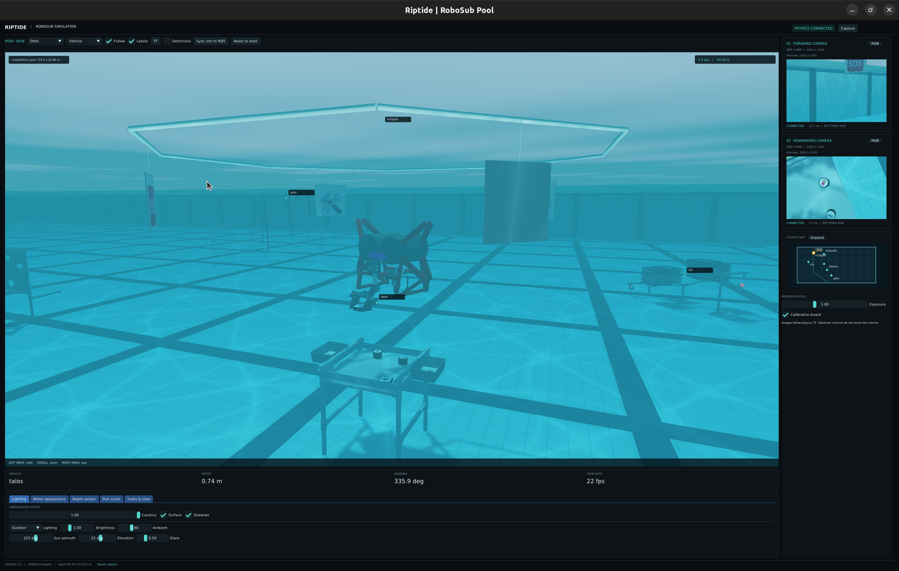

# Riptide simulator

The simulator runs underwater robot physics, simulated cameras, task interactions,
and competition scoring. Robot profiles describe the hardware; year packs describe
the tasks and rules. Talos and the 2026 course are the defaults.



## Run it

From the workspace root, with ROS and the workspace dependencies available:

```bash
colcon build --packages-select c_simulator camera_faker riptide_bringup2 --symlink-install
source install/setup.bash
ros2 launch riptide_bringup2 simulation.launch.py robot:=talos year:=2026
```

For a small standalone example with four thrusters, one camera, and two observation tasks:

```bash
ros2 launch c_simulator full_simulator.launch.py robot:=example_auv year:=example
```

Use `scenario:=empty_pool` for robot-only practice, or `with_camera_faker:=false`
for physics without rendering. `headless:=true` hides the window but still needs
an OpenGL 3.3 display. Physics and tasks run on the CPU; rendering uses OpenGL.
Camera image, depth, and point-cloud processing automatically uses CUDA when
built with a CUDA toolkit and a working NVIDIA GPU is available; otherwise it
uses the CPU. CUDA is optional.
See [camera acceleration](camera_faker/README.md#optional-cuda-acceleration) for
build options and forcing CPU processing.
Bullet and the Python dependencies in [requirements.txt](c_simulator/requirements.txt)
are needed for the existing contact models.

## Start here

- [How it works and where the code lives](docs/DEVELOPMENT.md)
- [Change settings or add a robot, task pack, or pool](docs/CONFIGURATION.md)
- [Viewer controls and camera outputs](camera_faker/README.md)

Detailed references: [physics](c_simulator/docs/PHYSICS.md),
[Talos mechanisms](c_simulator/docs/TASKS.md), and
[2026 scoring](c_simulator/docs/SCORING.md).
The [architecture and migration plan](docs/REUSABILITY_PLAN.md) describes a complete
refactor in a new project folder, with a standalone runtime, independent viewer,
optional ROS/UWRT integrations, and engineering quality gates. Old package/API
compatibility does not constrain the new design. The viewer supports simulation and live
robot visualization, with a path toward replacing RViz workflows and viewing
recorded data. Training integrations are out of scope; explicit stepping and
reset contracts keep that future use possible. Use the guides above for the
current implementation.

## Time and reset

Physics publishes `/clock`; tasks and sensors follow simulated time. Pause with
`ros2 param set /talos/physics_simulator real_time_factor 0.0` and resume with `1.0`.
Values between zero and one run more slowly.

**Reset run & tasks** clears task state and scoring without moving the robot.
`set_sim_pose` moves the robot and resets its dynamics and task time.
**Sync sim to ROS** aligns the simulated robot with the estimator while preserving
velocities and elapsed time.

The supplied hydrodynamic and contact parameters are estimates. The numerical
models are tested, but accurate predictions for a real robot require pool measurements.
