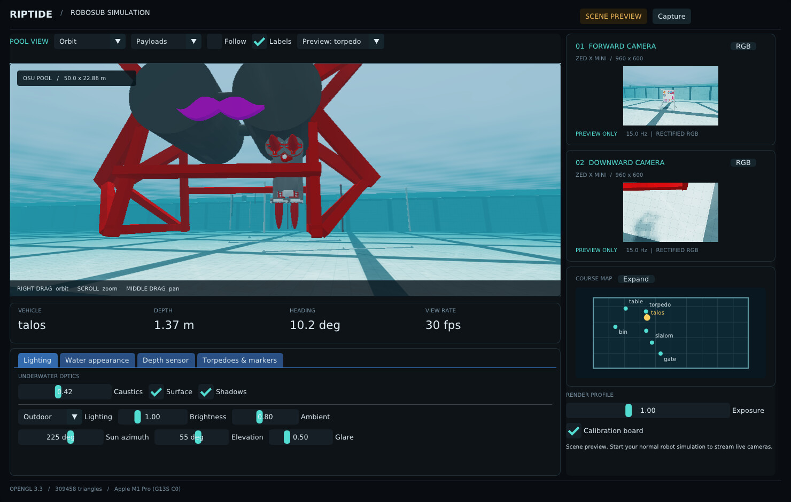

# Riptide RoboSub viewer

This reference describes the Talos viewer setup. For other robots, camera lists,
tasks, or pools, start with the [configuration guide](../docs/CONFIGURATION.md).

A new OpenGL 3.3 renderer and operator window, with forward and downward ZED X
Mini camera simulation. `c_simulator` provides the Fossen vehicle plant, collisions, simulated sensors,
and actuator response; your existing ROS nodes provide control and autonomy. The viewer
reads its TF tree and simulated projectile markers; optional task controls send the existing actuator commands. No CUDA, ZED SDK, browser, or network service is required.



[Bin task and downward-camera preview](docs/bins-preview.jpg),
[depth controls](docs/depth-preview.jpg), [expanded map](docs/course-map.jpg),
[four loaded payloads](docs/payloads-preview.jpg), and [water appearance](docs/water-preview.jpg).

## Build and run

From the release workspace, with its ROS dependencies installed:

```bash
source /opt/ros/humble/setup.bash
source install/setup.bash
colcon build --packages-select camera_faker --allow-overriding camera_faker
source install/setup.bash

# Explore the scene immediately; no physics/robot bringup needed.
ros2 launch camera_faker pool_viewer.launch.py demo:=true
```

The preview has gate, torpedo, bin, and table positions. These move only the
preview vehicle and never publish sensor messages, commands, or vehicle TF.
To open directly at a task:

```bash
ros2 launch camera_faker pool_viewer.launch.py \
  demo:=true demo_task:=torpedo initial_focus:=torpedo
```

Your existing `c_simulator/full_simulator.launch.py` and
`riptide_bringup2/simulation.launch.py` now open this viewer through the existing
`camera_faker/zedfaker.launch.py` entry point. Continue using your normal robot
bringup to provide the map/odom transforms and physical camera mounts. For
example, the workspace's complete simulation entry point is:

```bash
ros2 launch riptide_bringup2 simulation.launch.py robot:=talos
```

To attach just the viewer to already-running simulation:

```bash
ros2 launch camera_faker pool_viewer.launch.py robot:=talos
```

Do not run two camera publishers for the same robot. `pool_viewer` is the only
renderer; `zedfaker.launch.py` also starts the AprilTag detector.

Side camera previews default to 480 pixels wide (480×300 at HD1200). A camera
uses its configured sensor resolution when selected as the main view, captured
to a screenshot, or subscribed to for RGB, compressed RGB, depth, or point clouds.
Each camera switches independently and returns to preview resolution when its
last image/cloud subscriber disconnects. `CameraInfo` alone does not require a
full render; its dimensions and calibration always describe the sensor output.
Set `camera_preview_width:=640` to increase preview detail. `camera_scale` still
controls the resolution of actual sensor messages.

Set independent startup scales in [`config/cameras.yaml`](config/cameras.yaml).
For example, keep the forward camera full size and render the downward camera
at half width and height:

```yaml
/**:
  ros__parameters:
    ffc:
      resolution_scale: 1.0
    dfc:
      resolution_scale: 0.5
```

At HD1200, `1.0` produces 1920×1200, `0.5` produces 960×600, and `0.25`
produces 480×300. Values must be in `(0, 1]`, with at least 16 pixels on each
axis. A separate file can be supplied with `camera_settings:=/path/to/cameras.yaml`.
The existing common `camera_scale` launch argument multiplies both per-camera
scales; leave it at `1.0` when setting sizes independently.

These settings apply only at startup. Restart the simulator after changing the
YAML. Camera scale parameters are read-only while running; there are no live
scale controls. RGB, depth, CameraInfo intrinsics, and organized clouds all use
the configured startup resolution.
The small side-preview limit continues to apply when a camera has no image/cloud
subscribers and is not the primary view.

The normal `zedfaker.launch.py` entry point also starts an AprilTag detector,
which subscribes to the forward camera even when perception selects the downward
camera. Pass `with_apriltag:=false` through your simulation launch if tag detection
and tag-based navigation are not needed. The default remains `true`.

Depth noise, JPEG encoding, and ROS image/cloud publication run in one background
job per camera. RGB, depth, CameraInfo, and cloud outputs share an acquisition
timestamp, and depth previews/clouds use the same depth realization. If processing
is slower than the configured camera rate, acquisitions are skipped while that
camera is busy; there is no growing output queue. This keeps the viewer responsive
but does not guarantee the configured sensor rate under load. Full-resolution
camera output and perception still need CPU time, even when CUDA handles camera processing.

### Optional CUDA acceleration

`camera_compute: auto` in [config/cameras.yaml](config/cameras.yaml) selects CUDA
for depth conversion/noise, depth-preview coloring, and organized XYZ/RGB point
clouds. Compressed RGB images use nvJPEG when that optional library is built in.
Each camera logs its compute and JPEG backends at startup. Missing CUDA support,
an unavailable device/driver, or a processing failure selects the existing CPU path. A runtime failure retries that frame on
the CPU and keeps that camera on CPU for the rest of the run.

Override the YAML at launch with `camera_compute:=cpu` or `camera_compute:=auto`:

```bash
ros2 launch riptide_bringup2 simulation.launch.py robot:=talos camera_compute:=cpu
```

The setting is read-only after startup. Physics, task logic, ROS message assembly,
and GPU readback remain on the CPU. RGB scene rendering and water effects already
use OpenGL independently of CUDA; a display is still required.

Clouds and previews use the same noisy depth on the device; cloud coloring and
JPEG share one RGB upload. Cloud dimensions, NaNs, colors, intrinsics, and message
timestamps keep the existing conventions. Raw RGB pixels are unchanged. CPU/GPU
noise samples and JPEG bytes can differ. Both encoders use quality 93 and 4:2:0
sampling. Force CPU when comparing against previous seeded CPU runs.

If nvJPEG cannot initialize or encode a frame, JPEG alone falls back to OpenCV
and logs one warning; depth and clouds can continue on CUDA. A general CUDA
failure retries the complete acquisition on CPU before publishing anything.

Normal builds detect `nvcc` automatically. To enable CUDA after installing a
compatible NVIDIA CUDA toolkit, rebuild from the workspace root with a fresh
CMake cache, then source the workspace:

```bash
colcon build --packages-select camera_faker --symlink-install --cmake-clean-cache
source install/setup.bash
```

The build reports the compute and JPEG backends separately. nvJPEG requires the
toolkit's static `nvjpeg` and `culibos` libraries; without them JPEG stays on CPU.
`--cmake-args -DPOOL_ENABLE_NVJPEG=OFF` disables only GPU JPEG encoding. See the
[NVIDIA nvJPEG documentation](https://docs.nvidia.com/cuda/nvjpeg/) for the encoder API.

Add `--cmake-args -DPOOL_ENABLE_CUDA=OFF` to build without CUDA even if the toolkit
is installed. `-DCMAKE_CUDA_ARCHITECTURES=<architecture>` can target a particular GPU;
otherwise CMake uses the compiler's default. Runtime device selection uses the
first usable visible CUDA device; `CUDA_VISIBLE_DEVICES` can restrict selection.
CUDA's runtime is linked statically so a CUDA-enabled build can also start on a
machine without an NVIDIA driver.

GPU transfers have a cost; CUDA is not guaranteed to be faster at small image
sizes. Compare `profile:=true` timings with `camera_compute:=auto` and `cpu` at
your normal resolution and subscriber load.

Use `profile:=true` to log render dimensions and timings every three seconds.
Timings separate ROS callbacks, rendering submission, GPU readback, and the latest
background output job. Rendering submission is CPU time, not GPU execution time.
The camera, depth, and cloud publishers only produce output for subscribers;
headless cameras with only CameraInfo subscribers do not render images.

The viewer skips meshes whose bounding boxes lie entirely outside each view
before submitting them to OpenGL (frustum culling). This applies independently
to the observer, both robot cameras, water reflections, and the shadow map;
off-screen objects can still cast visible shadows or appear in reflections.
Water and its reflection pass are skipped when the water surface is out of view.
Objects hidden behind other objects are still submitted; depth testing handles
their pixels.

The isolated ROS regression exercises subscription changes, native image sizes,
and RGB/depth/CameraInfo/cloud registration:

```bash
ROS_DOMAIN_ID=176 python3 src/riptide_simulator/camera_faker/test/ros_camera_demand_smoke.py
```

## Viewer

- Orbit: left-drag to rotate, scroll to zoom, right-drag to pan.
- Free camera: left-click the viewport to capture the mouse, then move the mouse
  to look. WASD moves horizontally, Space rises, Shift descends, and Ctrl moves
  faster. Escape releases the mouse; switching windows also releases it.
- Focus selector: course, vehicle, gate, torpedo, bins, table, or payload launcher.
- Follow tracks the vehicle without changing physics. The main viewport can
  also display either actual rendered camera feed.
- Each camera card toggles between RGB and metric depth. Invalid depth is dark.
- Choose Indoor or Outdoor lighting. Adjust brightness and ambient fill; Outdoor
  adds sun azimuth/elevation and glare controls, including water highlights and
  bloom. Start in outdoor mode with `lighting:=outdoor`.
- Adjust water tint, distance-dependent haze and RGB absorption in **Water appearance**.
  Lighting controls retain animated caustics, exposure, surface rendering,
  shadows, and calibration-board visibility. These settings also affect sensor
  RGB, so vision can be tested across different appearances.
- The course map has a larger inset and an **Expand** button. In the expanded
  window, scroll to zoom, drag to pan, click a task to focus the pool view, or
  choose **Fit pool**.
- The **Depth sensor** tab adjusts noise and range live. **Show both depth maps**
  switches both camera cards; promoting a camera also shows its selected depth/RGB view.
- The **Tasks & claw** tab shows ammunition, task events and scores, with
  arm/fire/drop/reload controls when the task simulator is connected.
  **Reset all tasks** removes released torpedoes/markers, resets lights, table
  props and scores, and reloads/disarms the actuators without moving the robot.
- **Run score** starts/stops an individual-run timer and a RoboSub 2026 point
  ledger. The gate selects the scored role; **Detailed scorecard** shows awards
  and manual referee adjustments. **Focus → Octagon** inspects the new floating
  PVC ring and its signs. See [scoring rules and controls](../c_simulator/docs/SCORING.md).
- Capture writes the window and separate FFC/DFC RGB images to `/tmp`; the exact
  path is printed in the ROS log. `screenshot_path` overrides it.

The scene uses the existing 50 × 22.86 × 2.1336 m pool dimensions, lane geometry,
RoboSub meshes, original vinyl textures, and shared marker offsets. Task poses
come from the simulator mapping configuration, including its child frames and
blood/fire class assignments. Above-ground building walls, windows, and roof geometry have been removed; the
pool and its coping remain. Tile grout is filtered at a distance to reduce
flicker. Shadows use a 4096 × 4096 depth-only map, depth bias, and a weighted
filter of bilinear depth comparisons to smooth pixelated edges in the observer
view and both robot cameras.
The pool deck begins outside the wall thickness, removing the overlapping faces
that caused wall/deck flicker.

The default robot is a detailed, reduced copy of RViz's Talos3 CAD model
(about 1.09 million body triangles), with CAD surface normals preserved and the
baked-in torpedo/marker assembly removed. Its separate launcher and
four separate red payloads come from the Talos3 CAD: **two forward torpedoes and
two downward markers**, all using the same 83 × 26 × 26 mm finned exterior. The
launcher asset excludes its originally loaded round, so ammunition is never
baked into that mesh. Each loaded slot disappears when fired, and the same shape
moves from that exact position into flight. Reload/reset restores the loaded
rounds. **Focus → Payloads** or **Inspect launcher** in the task tab gives a close
view of all four slots. Demo mode shows a full load; live mode follows task state.
See [payload asset provenance](models/payloads/README.md) and
[body conversion instructions](models/talos3/README.md). The original RViz CAD
file is unchanged; vehicle dynamics and collision geometry remain configured
separately from the visual model.

### Robot status LEDs

Talos's optional `viewer.status_lights_config` points to
[`status_lights.yaml`](../c_simulator/robots/talos/config/status_lights.yaml).
Three emissive bars sit under the clear top of the port (+Y) hull. Their placement
and dimensions are estimates from the supplied robot photograph and CAD bounds.
They reuse the magnet task's LED material at four times its default radiance,
with a smooth HDR bloom pass. This is a visual glow, not a physical light-source
or heat model. The team describes the high-output LED board in its
[2024 design report](https://robonation.org/app/uploads/sites/4/2024/07/RS24_TDR_OhioStateUniv-compressed_1-1.pdf).

The relative `command/led` topic follows the selected robot namespace. RGB,
solid, slow flash (2 s), fast flash (0.5 s), and breath (3 s) follow `LedCommand`
and RViz's ROS-clock phase. The port lights accept ALU and ALL targets; NONE/CCB
do not change them. A singleton flash overlays the last status for the configured
`flash_duration` (0.15 s), then restores it. Lights start off until commanded.

Status lights do not depend on a task/year or a robot name. A robot without this
viewer setting creates no LED geometry or LED subscription. New robots can use
`std_msgs/msg/ColorRGBA` (RGB color, alpha brightness) instead of the UWRT message;
the renderer and animation state contain no Talos-specific placement or protocol.
For example, a robot-owned YAML file can contain:

```yaml
input:
  type: std_msgs/msg/ColorRGBA
  topic: command/status_color
lights:
  - id: top_beacon
    pose: [0, 0, 0.2, 0, 0, 0] # xyz/rpy in the model/origin frame, metres/radians
    size: [0.05, 0.02, 0.003]
    radiance: 200
```

Point `viewer.status_lights_config` at that file in the robot profile, or use the
`status_lights_config:=...` viewer launch override. Optional `target_mask` values
select command target bits; they default to all bits. Geometry, topic, radiance,
and singleton duration can all be changed without modifying viewer code.

Each bin vinyl now sits in a navy lattice crate, with white corrugated-plastic
liners covering the lower half of its walls. Geometry uses the CleverMade 25 L
crate's [published dimensions](https://www.clevermade.com/products/clevercrate-milk-crate):
13.12 × 13.12 × 11 inches outside and 12 × 12 × 10.68 inches inside. Vinyl positions
are preserved and treated as the interior floor. Liner thickness is an assumed
4 mm; height fraction and crate dimensions are configurable. These are procedural
approximations of the product, not a manufacturer CAD model.

Torpedo vinyl openings now cut through RGB, depth and shadow rendering. Their
centers and radii follow the inner edges of the four printed rings. The same
geometry drives passage scoring. Torpedoes and dropped markers are visible in
both cameras and the observer view. See [task setup and limitations](../c_simulator/docs/TASKS.md);
the claw supports rigid grasp/carry/release and basket delivery (see TASKS.md).

## Bin sensor lights

The bin's old square placeholders are clear-cover Polycase ML-22F approximations
with 16 bright LED lenses, visible electronics, screws and cable glands. Both
sensor faces tilt up 45 degrees. **Tasks & claw → Inspect lights**, or **Focus →
Light 1 / Light 2**, gives a close view. A printed stick and magnet follow the
robot's configured magnet frame.

A red light turns green after the magnet tip remains within six inches of its
sensor for 0.5 simulated seconds, then stays green until reset. Each light is
independent. The lenses emit HDR light with camera bloom under indoor and outdoor
lighting; actual red/green pixels appear in both robot cameras. Adjust
`magnet_lights.led_radiance` in the [2026 task config](../c_simulator/tasks/2026/config/tasks.yaml) for brightness (default 60).

[Red camera sample](docs/magnet-lights/red.png) ·
[Green camera sample](docs/magnet-lights/green.png) ·
[Behavior and reset service](../c_simulator/docs/TASKS.md#magnetically-activated-bin-lights) ·
[Geometry sources and measured detector limits](models/magnet_lights/README.md)

## Water appearance

**Water appearance** provides a color picker, clear-blue/pool/green-water presets,
and separate controls for scattering, distance strength, distance exponent, clear
distance, and red/green/blue absorption. More red absorption removes red sooner,
making distant objects appear bluer; the tint is the light scattered toward the
camera. Haze increases that tint and reduces scene contrast with distance. These
settings affect both ROS RGB feeds and the observer. Geometry depth is unchanged.

| Live parameter | Default | Meaning |
| --- | --- | --- |
| `water.tint` | `[0.025, 0.22, 0.29]` | RGB scattered-light color, each component 0–1 |
| `water.absorption` | `[0.095, 0.035, 0.025]` | RGB absorption coefficients, per metre |
| `water.scattering` | `0.10` | Haze coefficient, per metre |
| `water.distance_scale` | `1.0` | Multiplier for underwater viewing distance |
| `water.distance_power` | `1.0` | Exponent controlling how quickly the effect grows |
| `water.clear_distance` | `0.0` | Metres before attenuation/haze starts |

For underwater path length `d`, the adjusted path is
`D = (max(d-clear_distance, 0) * distance_scale)^distance_power`.
The surface contribution is multiplied by `exp(-(absorption + scattering)*D)`;
scattered water color grows as `1-exp(-scattering*D)`. Only the submerged segment
of a sightline contributes. Exponent 1 and clear distance 0 give exponential
attenuation; other values are appearance controls, not measured water optics.

Incoming surface lighting also loses color with depth below the water surface:
ambient, direct, and caustic lighting are multiplied by
`exp(-absorption * max(-z, 0))`, using depth in metres. This approximates a
vertical light path, so deeper objects become darker and lose red sooner even
at the same camera distance. The viewing-distance controls above apply only to
the object-to-camera path. Emissive materials, including LEDs, skip the incoming
light attenuation but still undergo the existing viewing-path attenuation.

```bash
ros2 param set /talos/pool_viewer water.tint '[0.015, 0.16, 0.24]'
ros2 param set /talos/pool_viewer water.scattering 0.045
ros2 param set /talos/pool_viewer water.distance_scale 1.5
```

## ZED X Mini camera outputs

Each prefix `/talos/ffc/zed_node` and `/talos/dfc/zed_node` provides:

| Suffix | Output |
| --- | --- |
| `left/image_rect_color`, `rgb/image_rect_color` | Rectified `rgb8` images |
| `left/image_rect_color/compressed`, `rgb/image_rect_color/compressed` | JPEG |
| `left/camera_info`, `rgb/camera_info`, `depth/camera_info` | Matching rectified intrinsics |
| `depth/depth_registered` | Registered `32FC1`, optical-axis depth in metres |
| `point_cloud/cloud_registered` | Organized, colored XYZ point cloud |

All messages from a camera observation share a timestamp and its
`talos/{ffc,dfc}_left_camera_optical_frame`. Images are rendered from the camera
mount at its physical simulated pose, never the observer viewpoint. The message
frames belong to the estimated robot's TF tree, including RGB, depth, camera info
and point clouds. Thus perception projects observations using its estimated pose
and can observe localization error; ground-truth camera TF is kept separately
under `simulator/talos/...`. Invalid/out-of-range depth is NaN. Default
point clouds sample every eighth pixel at up to 5 Hz and are generated only when
subscribed. Default camera output matches the configured HD1200 cameras:
1920 × 1200 at up to 15 Hz. An explicit `camera_scale:=0.5` selects 960 × 600
for reduced rendering cost. RGB, depth, JPEG and CameraInfo use the same resolution;
CameraInfo intrinsics scale with the image.

Each camera reads its own `riptide_hardware2/cfg/{ffc,dfc}_config.yaml`. Existing
`optional_opencv_calibration_file` paths are used when readable. Explicit
calibration overrides are supported:

```bash
ros2 launch camera_faker pool_viewer.launch.py \
  ffc_calibration:=/path/to/verified_ffc.yaml \
  dfc_calibration:=/path/to/verified_dfc.yaml camera_scale:=1.0
```

Accepted formats are an OpenCV stereo calibration (`K_LEFT`, `D_LEFT`,
`K_RIGHT`, `D_RIGHT`, `R`, `T`, `Size`) or ROS camera calibration with
`image_width`, `image_height`, and `projection_matrix.data`. Stereo calibration
is rectified with OpenCV, zero disparity, alpha=0. **Without a readable
calibration, the viewer warns and uses approximate 2.2 mm ZED X Mini intrinsics**
(105° horizontal / 78° vertical). Supply verified underwater calibration for
projection-sensitive autonomy tests; do not assume a saved calibration belongs
to this camera or lens.

This is a rectified pinhole RGB/geometry-depth simulator. It does not reproduce
the ZED neural stereo estimator, refractive camera housing or rolling exposure.
Water lighting/refraction is a raster approximation, not optical ground truth.
No right-eye image or disparity stream is claimed.

### Adjustable depth noise

All depth model controls have startup values in
[`config/cameras.yaml`](config/cameras.yaml), shared by both cameras. Edit
`depth_noise` (the UI's **Range coefficient**) and the `depth_model` section,
then restart the simulator to apply them. UI edits do not write back to this
file; **Reset noise** restores the built-in defaults, not the YAML values.

The **Depth sensor** tab changes ROS parameters live, without restarting. For
optical-axis depth `z` in metres, Gaussian standard deviation is
`base_sigma + depth_noise * z^range_exponent`. Defaults give 3.5 mm at 1 m,
15.5 mm at 3 m and 56 mm at 6 m, before outliers. Neighboring pixels can share
noise patches. Additional invalid pixels increase with range and at depth edges;
rare outliers model larger reconstruction errors. Samples outside the selected
range become NaN. RGB remains unchanged. Preview, ROS depth and cloud use the
same noisy observation, including invalid pixels.

| Live node parameter | Default | Meaning |
| --- | --- | --- |
| `depth_model.enabled` | true | Enable perturbations; range clipping remains active when false |
| `depth_model.base_sigma` | 0.002 | Constant standard deviation in metres |
| `depth_noise` | 0.0015 | Range-dependent sigma coefficient |
| `depth_model.range_exponent` | 2 | Power of depth in sigma |
| `depth_model.min_range`, `depth_model.max_range` | 0.15, 8.0 | Valid metric range |
| `depth_model.bias` | 0 | Constant metric offset |
| `depth_model.dropout` | 0.005 | Base invalid-pixel probability |
| `depth_model.range_dropout` | 0.10 | Additional probability × `(z/max_range)^2` |
| `depth_model.edge_dropout` | 0.20 | Additional probability at depth discontinuities |
| `depth_model.outliers` | 0.002 | Probability of an additional error up to ±25% of depth |
| `depth_model.correlation` | 0.5 | Fraction of noise variance shared spatially |
| `depth_model.patch_size` | 8 | Approximate correlation scale in pixels |

For ideal geometry depth within the selected range:

```bash
ros2 param set /talos/pool_viewer depth_model.enabled false
```

Setting only `depth_noise` to zero disables the range-dependent Gaussian term;
other effects remain. Start with both depth previews using `depth_preview:=true`.
These are **empirical test settings, not measured ZED X Mini underwater errors**.
Actual ZED depth depends on scene texture, stereo matching and confidence filtering
([Stereolabs documentation](https://www.stereolabs.com/docs/depth-sensing/confidence-filtering)).
This model approximates range/edge failures without running stereo inference.

The physics node owns the ground-truth FFC transforms; the viewer supplies the
ground-truth DFC mount and optical transform. All of these use the `simulator/`
prefix. Robot optical frames are supplied by the normal ZED description, or by
the viewer's fixed camera-link-to-optical joints when `zed_wrapper` is absent.
`publish_camera_optical_tf` controls that fallback; disable it if another node
already owns those joints. These robot frames always descend from the estimated
robot camera links, never the simulator base link. Sensor output waits for valid physics TF
and stops after one second without a new pose timestamp. Rendering continues so
the stale state is visible. The launch defaults `use_sim_time` to `true` so image
stamps share the physics simulator's `/clock` with its TF (vision markers are placed
at their header stamp, so mismatched clocks put them at the wrong vehicle pose);
it also suppresses repeated observations while ROS time is paused. Pass
`use_sim_time:=false` when running the viewer against a wall-clock simulator.

## Configuration and portability

The launch accepts `mapping_config`, `scene_config`, `robot`, `camera_scale`,
`ffc_calibration`, `dfc_calibration`, `demo`, `demo_task`, `initial_focus`, `publish_camera_optical_tf`,
`headless`, `lighting`, `use_sim_time`, `exit_after_frames`, `screenshot_path`,
`point_cloud_overlay`, `detections`, `robot_model`, `payload_model`, `launcher_model`,
`task_config`, and `depth_preview`. `detections:=true` (or the Detections checkbox)
draws `yolo_orientation` camera markers at the exact simulator camera pose used
to render their stamped image. When that acquisition is no longer cached, the
viewer uses timestamped `simulator/` camera TF; it waits if that transform is
missing rather than using the robot's estimated pose. Other marker frames use
their own timestamped TF. Each observation is placed once
and stays fixed in the world, including markers with `frame_locked` set. A zero
stamp uses the latest transform only at initial placement. The detector's
lifetime, replacement and deletion messages still control how long it remains.
Missing transforms are retried without substituting a newer pose.
Camera-view overlays use the pose and projection of the displayed
RGB or depth image, even while the vehicle moves between camera acquisitions.
`demo_task` uses `gate`, `torpedo`, `bin`, or `table`; `initial_focus` additionally
accepts `Course`, `Vehicle`, and `Payloads` for the 2026 pack. The selected year
provides mapping and viewer metadata; the selected robot provides its model and
camera list. Launch resolves them together, and full bringup forwards the same
mapping to the mapping node. Use matching robot/year/scenario selections when
starting the viewer separately.

Node-only parameters include `render_rate` (30 Hz), `fixed_frame` (`map`),
`depth_noise`, `depth_model.*`, `point_cloud.enabled/rate/stride`, and startup lighting parameters
`lighting.brightness/ambient/sun_azimuth/sun_elevation/glare`. Runtime lighting
adjustment uses the viewer controls. `water.*` and `depth_model.*` also support
live ROS parameter updates; settings start from their configured defaults on restart. Asset/configuration paths
are also node parameters. Launch files resolve package shares; no absolute
workspace path is compiled into the renderer.

Ubuntu requires a working OpenGL 3.3 desktop driver. Mesa and integrated GPUs
are supported; software rendering can work at reduced resolution/rate.
`headless:=true` hides the window and avoids rendering the observer view, but
still needs an X/Wayland display providing OpenGL. It is not an EGL offscreen
backend. Lower `camera_scale` if needed. Native-resolution dual cameras can cost
substantially more than the default.

The renderer uses GLFW, OpenGL, Assimp, OpenCV, yaml-cpp, GLM, and vendored Dear
ImGui 1.91.9b (MIT license in `vendor/imgui`). It builds without fetching packages
from the network. Keeping rendering in its own ROS node avoids introducing a
second physics engine or simulation clock. The GL loader and GLM are vendored
under `include/external`; scene import, lighting, water, camera publishing, and UI
live under `src/pool_viewer`, `include/pool_viewer`, and
`shaders/pool`.

## Verification

```bash
ctest --test-dir build/camera_faker -R pool_status_lights --output-on-failure
ROS_DOMAIN_ID=126 RMW_IMPLEMENTATION=rmw_fastrtps_cpp \
  python3 src/riptide_simulator/camera_faker/test/ros_status_lights_smoke.py
ctest --test-dir build/camera_faker -R 'pool_camera_geometry|pool_depth_noise' --output-on-failure
# Requires a desktop display. Use an isolated ROS domain for the synthetic TF fixture.
ROS_DOMAIN_ID=126 python3 src/riptide_simulator/camera_faker/test/ros_camera_smoke.py
# Capture a deterministic viewpoint (water animation advances with wall time).
ros2 launch camera_faker pool_viewer.launch.py demo:=true headless:=true \
  demo_task:=bin initial_focus:=bin exit_after_frames:=30 \
  screenshot_path:=/tmp/riptide-bins.png
```

The geometry test checks off-centre projection, metric depth inversion, downward
orientation, calibration scaling, and invalid calibration handling. The ROS
smoke test checks all nine topics per camera, timestamps, encodings, dimensions,
JPEG colors, cloud/depth registration, DFC floor depth, and missing/stale TF
recovery, live depth parameter changes, rejection of invalid ranges, and depth
through all four torpedo openings (including the CAD backing sheet). It also
checks live water-color changes in RGB, unchanged metric depth and invalid optical
parameter rejection. The noise
test checks range-dependent variance, correlated noise, clipping and dropouts.
It publishes fixture TF only within its selected domain and shuts down
its viewer when finished.

### Claw interaction

The **Tasks & claw** tab adds Open/Close/Stop claw alongside torpedoes and markers.
Use Stop to set a narrower approach gap near the table corner posts.
Enable the vehicle in RViz and arm actuators first. **Inspect claw** shows the
ribbed CAD pads and moving racks. All four table props move in the viewer and
both cameras as they are grasped, carried and released. Physics settings, ROS
commands and approximation limits are in [TASKS.md](../c_simulator/docs/TASKS.md#claw-and-table-objects).

### TF frames and payload alignment

Open **TF** in the pool-view toolbar and enable **Show TF frames**. Axes use
RViz colors (X red, Y green, Z blue) with optional frame names and adjustable
length. The checkbox tree follows actual TF parent relationships and includes
all frames by default, including `map`, course landmarks, and robot frames.
Expand a branch using its arrow. **Only this** toggles that frame independently
of its children. **With children** toggles the frame and all its descendants,
including collapsed branches. A filled square means only part of the branch is
visible; clicking it shows the whole branch. **Show all / Hide all** controls the
entire tree. Right-click menus also offer **Show branch / Hide branch**.
Selection survives closing the popup or toggling the overlay; new frames
follow the most recent Show all / Hide all choice. Axes show through geometry and appear only
in the viewer overlay, never in published camera images or depth data.

Live mode reads the TF buffer in the fixed frame (`map` by default), as RViz does.
The overlay also reports the ROS-estimate/simulator base-link separation in
centimetres and degrees, including the forward component, at a common timestamp. Frames disconnected from it are counted as unavailable. Localization drift can
therefore separate estimated robot TF from the simulated ground-truth vehicle.
Disconnected frames remain in the tree with an **unavailable** label.
Preview mode instead labels the fixed, configured base and payload frames as a preview.
Start with axes enabled using `show_tf:=true` on `pool_viewer.launch.py`.

Loaded payloads and release physics compose the robot actuator frames with the
CAD seating offsets in [Talos equipment](../c_simulator/robots/talos/config/equipment.yaml). TF aiming origins are separate from
the physical projectile centers. The four rounds remain inside the CAD launcher
and release continuously from their seats. Restart after configuration changes.

TF axes are captured once before rendering each viewer frame, and the base-link
error readout compares matching timestamps. The viewer uses the existing robot TF
rates and does not change the EKF. The CAD mesh offset comes from the vehicle
`base_link` configuration.
The viewer publishes `simulator/<robot>/origin` at this CAD origin. Select it and
`<robot>/origin` in the TF tree to compare them; the ROS-estimated and
simulated world poses remain visible independently.
