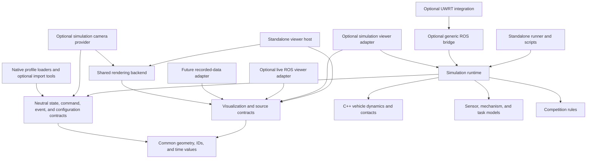

# Standalone simulator and viewer architecture plan

Status: proposed design, based on the source review on 2026-09-24. This document
supersedes the earlier plans that assumed ROS 2 or in-place compatibility would
remain required. Implementation is a complete refactor in a new folder. It does not
claim that the architecture below is implemented. See [Development](DEVELOPMENT.md)
and [Configuration](CONFIGURATION.md) for current behavior.

## 1. Goal and scope

Make the simulator usable by other RoboSub teams through robot configuration and
bounded extensions, without requiring ROS or UWRT packages. Build a new project
in a separate folder under `~/osu-uwrt/release`, with no requirement to preserve
the old simulator's packages, APIs, schemas, launch files, or internal structure.
Use Talos as an important reference use case. Make the viewer
an independently usable robotics visualization application, capable of growing
into an RViz replacement for the team's workflows. Simulation is one data source;
live robots and recorded data must not require a simulated world or running plant.

In scope:

- A standalone build and runtime, with optional ROS and UWRT integrations.
- Explicit simulation stepping, complete resets, and direct state/sensor access.
- Independent robot, world, mechanism, task, and competition descriptions.
- Optional rendering and viewer; physics-only runs require no graphics stack.
- A standalone viewer host with source, display, and tool extensions; optional
  adapters for simulation, live ROS, and other data providers.
- Viewer configuration independent of robot physics and competition scenarios.
- A direct programming interface usable by scripts and future integrations.

RL and other model-training implementations are out of scope. This work will not
add training frameworks, policies, rewards, datasets, training loops, vectorized
execution, or GPU physics. It will establish the lifecycle and dependency boundaries
that let those be added later. A direct Python interface is ordinary simulator
access, not an RL environment.

Evaluate the existing marine dynamics, contact solvers, and rendering backend as
reuse candidates, not architectural constraints. Port useful algorithms and assets
behind the new contracts; replace implementations when justified. The
simulator remains underwater-focused; the viewer's scene, frame, display, and
source contracts must not assume water, a pool, an AUV, or a competition year.
Full RViz feature parity, compatibility with its plugin/config formats, and a
complete recording/playback application are later projects. Establish their
extension points and prove a useful live visualization slice in this migration.
Package names, folders, languages, and build boundaries can change freely where
they improve the design. A complete refactor does not require rewriting sound
algorithms or building speculative frameworks. Simultaneous interacting
robots, arbitrary terrain, stable third-party binary plugin ABIs, and save/restore
of arbitrary mid-run checkpoints are deferred. Independent runtime instances must
not share mutable simulation state.

### New project and relationship to the old simulator

Use `~/osu-uwrt/release/robotics_platform/` as the provisional project root;
the final project name is not an architectural decision. This is a sibling of
`src/`, with its own build/install directories and project-level documentation.
The folder layout below is a proposal to bootstrap in phase 0, not an already
created implementation. This planning document stays here until that bootstrap.

The new project must build from its own checkout without the old simulator's
source tree, build outputs, ROS installation, or workspace environment. A later
repository split is possible but not required for the design. Do not alter Git
submodule structure or retire the old project as part of planning.

Use the old simulator for reference runs and selective ports. Review every port
for dependency direction, ownership, licensing/provenance, and intended behavior.
Do not copy whole packages and then treat their coupling as a compatibility
obligation. Copy necessary content with attribution or declare an installable
dependency; do not reach into sibling directories at runtime. Optional UWRT
integrations may depend on the robot stack, but the standalone products may not.

Distinguish fidelity to physical models and supported user workflows from source,
binary, launch, schema, and UI compatibility. The former requires validation; the
latter is not required for the old project. Keep known bugs out of reference
expectations. Once the new project's public interfaces are released, apply its
own versioning and deprecation policy from section 11.

## 2. Current foundation and remaining coupling

Paths below are relative to the existing `src/riptide_simulator` repository.
They identify reference code, not the new project's required layout.

| Area | Existing foundation | Remaining boundary violation |
| --- | --- | --- |
| Numerical models | `MarineDynamics` and `ThrusterDynamics` use ordinary numerical types. | `RobotClass.h` and `robot_class.cpp` combine physical state/configuration with ROS nodes, TF, message types, and special handling for `ffc`. |
| Execution | Fixed physics substeps, simulated sensor schedules, seeded physics noise, pause support. | `physics_simulator.cpp` owns integration inside a ROS/wall-time loop, plus sensor synthesis, telemetry, kill commands, and estimator synchronization. |
| Profiles | Robot/year/world/scenario selection, arbitrary thruster counts and camera lists, an independent example AUV. | `profiles.py` emits ROS parameter and UWRT mapping-shaped data; standard installed-resource lookup uses ament. Adapter choice is a built-in `generic`/`uwrt` switch. |
| Mechanisms | Robot-local behavior registration and capability declarations. | Constructors receive a ROS node. Talos `bind(runtime)` mutates task-runtime fields and registers callbacks; capability names alone do not define a reusable behavior interface. |
| Tasks and rules | Example/2026 packs and extracted scoring/model helpers. | Both task entry points inherit from ROS `Node`. The 2026 node also owns payload/prop simulation and uses wall-time freshness checks. |
| Contacts | Vehicle contact response and prop models have separate owners today. | `TaskContacts` knows claw jaws and named table/basket assets; C++ and Python exchange prop/jaw state over ROS. Update order is not one coordinated simulation transaction. |
| Graphics | Renderer, camera processing, and panel presentation have useful separations. | `PoolViewer` owns ROS communication, cameras, window lifecycle, and UI. Renderer still recognizes named course objects and UWRT mapping structure. |
| Viewer composition | `panels/composition.hpp` and `panels/capabilities.hpp` separate some panel presentation from providers. | The host remains simulation-oriented; panel capabilities cover operator workflows rather than general visualization sources/displays. A standalone viewer must not require a `RunDescription` or simulation runtime. |
| Installation | Existing colcon packages and functional/smoke tests. | Both CMake files require ROS and UWRT messages; manifests also pull in robot-stack packages. Runtime opt-out does not remove build/install dependencies. |

The example robot currently demonstrates reuse within ROS. It does not yet prove
standalone execution. Reuse its domain knowledge and fixtures where useful;
the new project is free to define cleaner schemas and interfaces.

## 3. Target dependency boundaries

Arrows below mean "depends on". Optional adapters depend inward. The simulation
runtime and viewer host are independent consumers of small neutral contracts;
neither requires the other to run.



These are logical boundaries first; they need not become one package each.
The runtime receives validated configuration and optional providers from the runner.
ROS launch and a standalone runner are two ways to construct the same simulation.
A viewer composition root loads selected adapters, displays, panels, and tools.
Its simulation adapter translates runtime snapshots into visualization data; the
live ROS adapter consumes existing robot streams without starting a simulator.
These are separate from the simulator's ROS bridge. Share transport utilities
where useful, without giving the live viewer a runtime/plant dependency. An
in-process simulation adapter is sufficient initially; process/network transport
can be added behind the same source interface.

### Ownership

| Component | Owns | Does not own |
| --- | --- | --- |
| Plant | Vehicle state, actuator dynamics, vehicle collision response. | ROS topics, estimator state, competition scores. |
| Runtime | Simulation time, scheduling, command application, reset coordination, authoritative state registry. | Wall-time pacing or transport-specific messages. |
| Robot/mechanism models | Mounts, device state, actuator sequencing, equipment capabilities. | Competition rules or access to a task node's private fields. |
| Dynamic-object models | Payload/prop trajectories and attachment transitions under an explicit ownership contract. | A second independent integration of vehicle state. |
| Task models | Interactions with configured entities and resulting events. | Robot-native command protocols. |
| Competition rules | Run state, eligibility, scoring from observations/events. | Physical outcomes or training rewards. |
| Sensor models | Acquisition schedule, measurement generation, noise/drift state. | Publishing, topic names, or device-driver message layouts. |
| Render backend | Drawing supplied geometry/images and producing requested render targets. | Simulation lifecycle, ROS, scoring, or mandatory underwater effects. |
| Viewer host/displays | Presentation state, layout, selection, inspection, and display-time transforms. | Physics, sensor acquisition, or mandatory robot command interfaces. |
| Viewer source adapters | Stream discovery, data conversion, source clocks, connection state. | Inventing ground truth or requiring a simulator for live data. |
| Viewer control providers | Explicitly bound commands and their acknowledgments/status. | Implicit control authority from a visualization subscription. |
| Integrations | Topic/message conversion, TF export, stack startup, estimator synchronization. | Authoritative simulation state outside the runtime. |

Use C++ for the numerical plant and Python for behavior/rules as a starting
proposal, subject to profiling and maintainability review.
Use an in-process binding between these layers rather than ROS as an internal
function-call mechanism. Proposed starting point: a Python runtime coordinator
calling C++ advance operations, with physics substeps remaining in C++. Confirm
binding granularity and contact synchronization against performance and behavior
baselines before moving the contact path. Do not require Python in the minimal
C++ plant library or its standalone tests.

The runtime is a coordinator composed from model instances, schedules, state
storage, and event routing; it must not become a class that implements every
sensor, device, or task. The viewer host composes sources, displays, panels, and
tools by the same principle. Design rules and enforcement are in section 11.

## 4. Core contracts

### State, commands, and observations

Define a small set of typed contracts shared across language boundaries:

- `RunDescription`: validated robot/world/task configuration and enabled providers.
- `Command`: target entity/device, operation, parameters, and application tick.
- `Snapshot`: run generation, tick/time, body and mechanism states, task/run state.
- `SensorSample`: device ID, acquisition tick/time, frame, measurement, validity,
  and uncertainty where applicable.
- `Event`: source/target IDs, event type/version, tick/time, and typed payload.

ROS messages, JSON envelopes, RViz markers, and mapping YAML are boundary formats.
They must not be the internal representation. Start with the command/event types
needed by existing models; avoid a general-purpose event bus or schema language.

Separate model identity, runtime instance ID, and ROS namespace. Preserve explicit
SI units, quaternion ordering, body/world velocity conventions, and CAD/base/COM
transforms. Keep the current world-Z-up and body-FLU conventions initially. An
importer can translate another team's conventions. Ground truth and estimated
state remain distinct; incoming TF must not be needed to discover physical mounts.

Snapshots are read-only outputs, not writable access to model internals. Reading
state or refreshing the UI must not consume random numbers or advance sensors.
Camera requests identify the snapshot/acquisition they render, even when rendering
finishes later. Sensor access remains separate from privileged ground-truth access
so a future consumer can choose its observation policy explicitly.

### Lifecycle and time

Conceptual API, not a finalized signature or training-framework API:

```text
configure(run_description)
reset(initial_conditions, seed) -> snapshot
apply(commands) -> acceptance results
advance(number_of_ticks) -> snapshot, acquired_samples, events
observe() -> latest snapshot
close()
```

One runtime owns integer simulation ticks and a configured fixed step. `advance`
returns after the requested work completes; it never waits for wall time, a ROS
message, or a viewer refresh. Commands are validated and applied at defined tick
boundaries, with deterministic ordering and explicit duplicate/late-command policy.
For live ROS input, record the tick actually assigned by the bridge; network arrival
order is not itself a reproducible experiment specification.

One coordinated tick has defined phases: apply commands; update mechanisms and
physical models/contact exchange; commit physical state; derive interactions and
scores; sample due sensors; expose the completed snapshot/events. Exact internal
substeps and contact ordering must be documented and regression-tested during
extraction. Task effects that change physics are explicit model operations at a
specified boundary, not arbitrary writes while another solver advances.

Sensor rates have explicit tick scheduling/rounding rules and retain acquisition
timestamps. Rendering and transport can run slower than physics without changing
physical time. A camera backend can be invoked synchronously for requested samples;
an interactive client may drop display frames without discarding required samples
silently. No-render configurations omit camera acquisition explicitly.

A runner optionally paces ticks against wall time. Pause stops advancement while
allowing inspection and reset. Middleware connection watchdogs use wall time in
the bridge; simulated command delays/timeouts use simulation time in the models.
ROS `/clock` is an exported clock, not the runtime's source of truth.

### Reset and reproducibility

Keep three different operations explicit:

| Operation | Contract |
| --- | --- |
| Full run reset | Restore selected initial conditions, time/tick, actuator queues, sensor histories/noise, mechanisms, payloads/props, attachments, events, tasks, and scoring. Reset random streams from the supplied seed. |
| Task/run reset | Reset the documented task/score/mechanism state while retaining vehicle pose and dynamics. Specify affected state in the new contract; do not infer it from legacy side effects. |
| Pose placement/synchronization | Change a specified pose, with explicit velocity/dynamics preservation options. Estimator alignment is a separate UWRT operation. |

The runtime completes a reset atomically while paused or running, increments a
state generation, and exposes the new snapshot immediately. Bridges discard stale
queued data from earlier generations. Define clear service names and UI actions
for these operations. Any optional old-interface adapter must document its mapping;
no legacy reset semantics are required in the core. Document how an elapsed-time
rewind maps to ROS timestamps and downstream TF caches.

Derive independent random streams from a root seed and stable model/device IDs.
Adding an unused sensor or opening the viewer must not perturb physics noise.
Record resolved configuration, model/code versions, seed, and applied command ticks.
Initially promise repeatability within stated numerical tolerances on a supported
build/backend. Do not promise bitwise-identical results across CPU/GPU platforms.
Legacy asynchronous task execution does not meet this contract until migrated.

Every instance owns its mutable state, solver clients, buffers, and random streams.
Test isolation without implementing a parallel training runner. Checkpoint/restore,
batched observations, and high-throughput execution can build on these contracts
later; they are not acceptance requirements for this migration.

## 5. Profiles and extension model

Define native versioned schemas around robot, world, task/competition, scenario,
and viewer-workspace concepts. Keep one authoritative resolved description.
Existing Talos YAML/URDF and course files can be converted as development inputs;
permanent support for every old format is not required. Ongoing imports are optional
edge tools chosen for user value, not a prerequisite for loading native content.

- Robot profiles describe physical hardware, mounts, sensor/device instances,
  collision/visual assets, and registered mechanism models.
- World descriptions own water, shared frames, static geometry, and entity IDs.
  Visual meshes and collision proxies share transforms but may differ in detail.
- Task packs describe task instances, interaction models, and required capability
  interfaces. Competition packs supply rules and presentation metadata.
- Scenarios compose these inputs, initial conditions, seed, schedules, and enabled
  integrations. Empty tasks, sensors, cameras, and mechanisms remain valid.
- Integration configuration owns namespaces, topics, message conventions, driver
  emulation, hardware config translation, and UWRT-specific viewer tools.

Capability contracts must specify operations, state, and events, not just names
such as `launcher`. Replace `bind(runtime)` with a narrow mechanism context and
explicit model operations. For example, a launcher requests payload creation and
receives its entity ID; it does not append directly to a task node's payload list.
Mechanisms must work in an empty world without requiring a competition pack.

Give each body one authoritative solver owner. Attached props need a documented
transition between free-body and attached state; contact proxies never become
second owners. Design the contact/mechanism interface from these responsibilities;
use the old claw/table behavior as a validation case. Revisit solver ownership or
splitting if the new design requires it, with documented physical evidence. A dynamic
C++ plugin ABI and universally interchangeable solvers are unnecessary here.

Resolve local assets relative to the declaring profile. Add explicit installed
resource roots without ROS; keep `package://` resolution as an optional ROS-backed
resolver. Record resource provenance/content identity independently of machine-local
absolute paths. Produce mapping/RViz exports only when an integration needs them.
A standalone physics-only profile must not require camera or Talos asset packages.

Use versioned configuration and behavior interfaces with clear validation errors.
A team should be able to supply profiles/assets and Python or compiled extensions
outside the simulator repository. Register only selected extensions, so an unused
UWRT adapter cannot introduce import dependencies. Adding a new device behavior
may require code; adding another instance of an existing device should require data.

## 6. Standalone viewer design

The viewer must start with an empty workspace and no simulator, ROS connection,
robot profile, course, or scoring module. A workspace selects sources and displays;
it can inspect a static asset, visualize a live robot, or attach to a simulation.
The same display implementation should consume equivalent data from any adapter.
Rendering several robots or estimates does not imply multi-robot simulation.

### Sources, displays, panels, and tools

Keep these extension roles separate. Reuse useful panel/provider concepts from
the existing viewer, while freely redesigning its registry and interfaces:

| Extension | Responsibility | Example |
| --- | --- | --- |
| Source | Advertise streams/types, receive data, expose source identity/time/health, and release resources on disconnect. | Simulation snapshots, live ROS topics, local assets, a future recording reader. |
| Display | Interpret a selected neutral data type into visual objects with configurable appearance and status. | Robot model, frame axes, poses/paths, images, point clouds, markers. |
| Panel | Present properties, data inspection, diagnostics, or a selected capability. | Source browser, display properties, scorecard, actuator readings. |
| Tool/control provider | Handle an interaction and optionally send an explicitly bound command. | Selection, measurement, camera navigation, robot goal, simulation placement. |

Version these interfaces and allow external registration without editing the host.
Use compiled-in registrations or separately built extensions first; binary
compatibility with arbitrary RViz plugins is not required. Keep UWRT commands,
competition panels, simulator controls, and underwater appearance in optional
extensions/presets. Do not expand one central enum with every team's device type.

The first live visualization slice should cover robot models/joint poses, frames,
pose/path data, markers, images, and point clouds, prioritized against the team's
actual RViz workflow inventory in phase 0. Define the exact supported forms in the
acceptance checklist; a generic "markers supported" claim is insufficient.
Additional displays, maps, interactive marker protocols, and transport formats
can follow without changing the host. Full RViz replacement is an incremental
workflow goal, not a claim made when the shell first runs standalone.

### Visualization data and time

Use visualization contracts independent of physics state: geometry/assets,
robot link/joint poses, frame transforms, images, point clouds, annotations, and
presentation metadata. Share basic pose/ID/time value types with the simulator,
but do not make every source manufacture simulation ticks, scores, or ground truth.
Retain large image/cloud buffers through explicit lifetime ownership; avoid
copying every stream into a monolithic simulation-shaped snapshot.

Each stream/update carries source identity, frame, timestamp and clock domain,
generation, validity, and stable object IDs where applicable. Define add/update,
remove, lifetime expiry, and clear-source semantics. Namespaced identities prevent
two sources' `base_link` frames or marker IDs from overwriting each other.
Keep overlays such as truth, estimated pose, and planned paths separately labeled.

Provide timestamped frame lookup behind a neutral interface. A ROS adapter may
use TF; non-ROS sources can supply their own transform history. A display resolves
data into a selected fixed frame at the sample's timestamp, with explicit handling
for static transforms, interpolation, and missing/out-of-range transforms. Show
unavailable/stale status rather than silently drawing at the origin or treating
the latest transform as historically correct. Preserve the distinction between
measured-time placement and explicitly configured frame-following visuals.

The viewer's presentation clock is distinct from a source clock and from the
simulation clock. Live streams are asynchronous and need not form an atomic frame.
Recorded sources may eventually pause, seek, or rewind; on generation/time changes,
clear incompatible transform caches, trails, and expired objects. Do not compare
timestamps from unrelated clocks without a configured mapping. Overlay sources
only with explicit frame/time alignment; display receipt age separately where
acquisition age cannot be established.

Source callbacks feed bounded queues; the render/UI thread owns graphics objects.
Define queue/drop/decimation policies per display and report gaps/staleness. A slow
viewer must not stall physics or a live publisher. These display policies do not
change the simulator's required sensor acquisition or future recording semantics.
Disconnect removes/invalidates only that source's state and cancels its pending
interactions. Reconnection rebuilds state without restarting the whole viewer.

### Workspaces and interaction

Add a versioned viewer workspace description independent of simulation scenarios.
It stores source bindings, displays, fixed frame/time selection, layout, camera
views, visual properties, and optional tool bindings. Resolve assets relative to
the workspace or declared resource roots. An unresolved source/plugin is reported
locally so the rest of a saved workspace can still open. Simulator profiles may
offer a viewer preset, but opening it must not launch a plant implicitly.

Separate visualization access from command capabilities. Live and recorded data
can be viewed without any control provider. Enable simulation reset/teleport only
when a simulation control provider is explicitly bound; live robot goals and
actuator commands use separate providers with clear target, frame, and status.
Do not reuse a simulator pose-placement action as a live robot motion command.
Playback pause and simulation pause remain distinct actions. Selection, camera
movement, and display edits never publish robot commands or modify physical state.

### Shared renderer, independent sensor generation

Share mesh loading, rendering primitives, materials, and camera geometry between
the viewer and simulation camera backend. Keep window/UI setup, source adapters,
and simulated camera acquisition outside that shared backend. Underwater effects
are optional rendering configuration; a live point-cloud workspace needs no pool.

A live image display shows a supplied image. A simulated camera provider acquires
an image from an authoritative simulation snapshot and sensor configuration. Viewer
overlays, selection highlights, hidden objects, and camera navigation must not
leak into sensor products. Give sensor and display rendering separate scene/view
configuration even if they share immutable GPU assets. Changing viewer appearance
must not alter training observations or simulated camera output.

## 7. Build and rendering boundaries

Provide these independently installable/buildable layers; names are provisional:

| Layer | Allowed dependencies | Excluded dependencies |
| --- | --- | --- |
| Plant/contracts | C++ standard library, Eigen; contact library where used. | ROS, UWRT, Python, graphics. |
| Config/runtime/models | Neutral plant binding, YAML, existing numerical/Python model dependencies. | ROS, UWRT, mandatory graphics. |
| Visualization contracts/render backend | Common value types, graphics/image processing as needed by rendering. | Simulation runtime/plant, ROS, UWRT, mandatory Python. |
| Viewer host/displays | Visualization contracts, rendering, UI, selected source/tool interfaces. | Simulation runtime/plant, ROS, UWRT, mandatory Python or course packs. |
| Simulation viewer adapter/camera provider | Runtime contracts and visualization/rendering interfaces as needed. | Mandatory ROS/UWRT. |
| Live ROS viewer adapter | Viewer source interfaces and ROS dependencies for supported inputs. | Simulation runtime/plant, UWRT. |
| Generic ROS bridge | Runtime and standard ROS interfaces. | Mandatory UWRT messages or robot packages. |
| UWRT integration | ROS bridge, UWRT messages/config imports/tools. | No reverse dependency from other layers. |
| Content packs | Declared model/asset dependencies for the selected robot/course. | Implicit installation of all robots and years. |

Start with plain CMake library targets and standard Python packaging where Python
is used. New optional ament packages depend on the standalone libraries; the old
packages do not become compatibility shells. Optional runtime flags are
insufficient if build discovery or manifests still force robot-stack dependencies.
Select new executable/package names for clarity. Require only explicitly selected
components and dependencies in each build.

### Proposed repository structure

```text
robotics_platform/
  CMakeLists.txt              # Standalone targets; optional features opt in
  CMakePresets.json           # Repeatable supported build configurations
  cmake/                     # Target export and dependency helpers
  libraries/
    common/                  # Small geometry, identity, and time value types
    simulation/              # Plant and simulation contracts
    visualization/           # Source/display contracts and neutral scene data
    rendering/               # Rendering and asset loading
  python/                    # Packaged runtime/models and Python API
  bindings/                  # Explicit C++/Python boundary
  applications/
    simulator/               # Standalone runner/composition root
    viewer/                  # Independent viewer/composition root
  extensions/
    models/                  # Sensors, mechanisms, interactions, rules
    displays/                # Optional visualization displays and tools
  integrations/
    simulation_view/         # Runtime-to-viewer and camera provider composition
    ros2/                    # Separate simulation-bridge and live-viewer packages
    uwrt/                    # Optional stack protocols, tools, bringup
  content/                   # Native robots, worlds, tasks, and scenarios
  workspaces/                # Viewer presets, independent of simulation scenarios
  examples/                  # Small installed-API and external-extension examples
  tools/                     # Development utilities and one-time content converters
  tests/                     # Cross-component contracts and integration fixtures
  benchmarks/                # Repeatable performance cases
  docs/                      # Guides, API contracts, design decisions
  .github/                   # CI, contribution templates, ownership configuration
```

Folders express responsibility, not a mandate for one package per folder or one
class per file. Each compiled library exposes a small installed `include/` surface
and keeps implementation in `src/`; colocate focused unit tests with the component.
Python packages use an installable source layout and explicitly export supported
APIs. Keep assets out of code libraries and declare content dependencies separately.
Add folders/targets when their first useful implementation exists, rather than
generating empty framework scaffolding for every possible extension.

Use target-scoped CMake settings and exported targets, no global include/link path
injection. Optional components must not trigger mandatory discovery of unused
dependencies. Provide documented standalone and ROS-overlay build commands with
explicit package selection, so placing this project beside the old workspace
does not accidentally add it to an existing colcon build. Generated artifacts live
under the new project's ignored build directories, never in the old workspace's
shared build/install outputs. Verify installed C++ consumers and Python imports.

Viewer-only builds must exclude plant bindings, Python task models, and simulator
content. The live ROS viewer package must install without `c_simulator`. Separate
its dependencies from the generic simulator ROS bridge even if both use common
ROS conversion helpers. Prove this with dependency-isolated builds.

Separate camera acquisition and interactive UI under the new contracts in section
6. Port renderer/camera-processing components where they fit those contracts.
Provide a real offscreen context for camera rendering without a desktop; graphics
hardware/driver requirements remain backend-specific. Do not describe the existing
hidden GLFW window as display-independent headless support. Move named task visuals
and robot LED/payload conventions into content descriptors or selected extensions.
Reuse existing panel presentation and adapters where possible.

## 8. Migration sequence and acceptance gates

Each phase builds a reviewable increment inside the new project. The old simulator
remains independently usable as a reference; there is no required dual-maintenance
or shim layer. Validate intended physical behavior and selected user workflows,
not incidental legacy interfaces or bugs. All tests below are planned work, not
results of this design review. Engineering gates in section 11 apply to every phase.

The simulation and viewer tracks share contracts but need not wait for each other.
Phase 5A can start after phase 0 defines source/frame/time contracts; it does not
depend on extracting physics or 2026 tasks. Phase 5B integrates the standalone
runtime once phase 2 is ready and migrates task visuals alongside phase 4.

### Phase 0 — Bootstrap the project and specify contracts

Work:

- Create the new project root and minimal standalone build/install/test setup.
  Establish contribution/design rules, decision records, dependency boundaries,
  format/lint configuration, CI presets, and license/provenance inventory.
- Inventory current commands, sensors, frames, reset services/buttons, timing,
  mechanism state, and contact ownership. Include dependencies in `riptide_launch`.
- Specify command application, clock/reset behavior, frame conventions, and the
  neutral data types from section 4 before moving execution code.
- Inventory current viewer and RViz workflows, required input/display forms,
  fixed-frame/time behavior, and operator tools. Define the first live-viewer
  acceptance checklist separately from eventual RViz parity.
- Capture representative Talos and example runs: motion, delayed thrust, noisy
  sensors, pause/resume, placement, task reset, payloads, grasping, and scoring.
- Measure existing physics/contact/render rates and startup overhead to establish
  a comparison baseline. Separate repeatable numerical fixtures from asynchronous
  ROS smoke tests; do not treat network arrival timing as a golden trajectory.

Gate: a capability matrix identifies required behavior and deliberately retired
legacy conventions. The new project has build/test scaffolding and engineering
guidelines. Reference results and known model limitations are recorded; the first
plant has agreed numerical tolerances and explicit frame/time semantics. Viewer
contracts support live input with no simulation.

### Phase 1 — Build the standalone vehicle plant

Work:

- Implement native plant parameters/state and compose dynamics, actuators, and
  contacts without ROS types. Port useful marine/thruster calculations with attribution.
- Implement fixed-step integration, actuator queues, and basic pool/static contacts.
  Start with the reference numerical method; validate intentional algorithm changes
  against analytical cases and documented physical expectations.
- Add a minimal C++ runner loading the example AUV and empty pool. Accept a fixed
  command sequence and emit timestamped state without ROS or rendering.
- Keep the new plant independent of the old source/install tree. Do not modify the
  old physics node to call it or retain old task plumbing in the new library.

Gate: clean non-ROS build/run of the example; identical inputs reproduce vehicle
trajectories within stated tolerances; ported Talos physics fixtures pass or
intentional model differences have reviewed evidence.
This is the first implementation milestone. It does not require an RL wrapper or
complete standalone task/camera support.

### Phase 2 — Establish neutral configuration and runtime lifecycle

Work:

- Implement native profile loading/validation and filesystem resource roots.
  Convert selected reference fixtures offline; test staged installation.
- Introduce the direct runtime interface and the C++/Python boundary. Centralize
  ticks, command application, complete plant reset, seeds, and read-only snapshots.
- Extract nonvisual sensor models from ROS publication; keep simulated schedules,
  mounting transforms, noise, drift, and uncertainty in the models.
- Add a standalone CLI and direct Python example for configure/reset/advance/observe.
  Keep ROS integration out of the standalone lifecycle.

Gate: the example AUV exposes state and nonvisual samples without ROS; repeated
seeded command sequences reproduce results; two independent instances do not
interfere; reading snapshots does not change later results. Install/run tests use
only declared resources, with no workspace or ROS resource lookup.

### Phase 3 — Separate generic ROS and UWRT integrations

Work:

- Move standard ROS publication/subscription, TF, `/clock`, and service conversion
  into the generic bridge. Keep bridge callbacks from mutating models directly.
- Move UWRT kill/telemetry, driver-shaped camera conventions, estimator alignment,
  hardware-description imports, and operator tools into the UWRT integration.
- Create new package manifests and entry points for generic ROS and UWRT users.
  Integrate with selected robot-stack interfaces through explicit adapters only.
- Choose supported topics/services/frame conventions for each integration and test
  them. Old launch names and configuration layouts are not acceptance requirements.

Gate: generic ROS plant/sensors build and run without UWRT packages; the Talos
adapter exercises the selected stack interfaces using the new reset contract.
Standalone runs remain ROS-free. Full viewer/task independence remains a separate
gate, not a claim of this phase.

### Phase 4 — Extract mechanisms, tasks, and coordinated contacts

Work:

- Migrate the example beacon and observation task first to prove node-free lifecycles.
- Separate Talos mechanism state/commands from ROS callbacks and the task node's
  fields. Move payload/prop ownership into explicit model components.
- Stage the Talos/course descriptions and assets as declared content resources.
  Legacy ROS-package imports may run during conversion, but the resulting
  standalone pack must load without ament or robot-stack installation.
- Bring vehicle/prop/contact exchange under the runtime schedule; specify substeps,
  attachment transitions, impulse/correction ownership, and event ordering.
- Migrate 2026 interactions and scoring onto snapshots/events, preserving rules.
  Replace wall-time truth freshness checks with synchronous state availability;
  keep communication health checks in bridges.
- Support task instances by ID and selected extensions without core robot/year
  switches. Native task composition must support selection by instance; stage the
  2026 conversion incrementally without hardwiring course-wide enablement.

Gate: example mechanisms/tasks and the full Talos/2026 models run without ROS;
mechanisms operate in an empty pool; contact/launch/grasp/scoring checks pass;
full reset clears attachments, queues, noise, props, and pending events. Recorded
commands reproduce full simulation outcomes within documented tolerances.

### Phase 5A — Establish the standalone visualization host

Work:

- Build the viewer host, neutral scene/display contracts, and workspace loader.
  Port useful rendering/panel code without adopting the old host lifecycle.
- Add a local asset/synthetic-stream source to exercise frames, asynchronous data,
  time jumps, and reconnects without ROS or the simulator. A fixture proves the
  lifecycle; a complete recording reader is deferred.
- Add a live ROS source with discovery/binding and configurable transport settings
  for the supported streams. It must not depend on the simulator's ROS bridge.
- Implement the phase-0 display checklist through source-independent displays,
  plus source/display status and fixed-frame selection.
- Move UWRT operator tools into optional providers. Keep visual inspection usable
  with all command providers absent. Save/reopen workspaces without a scenario.

Gate: viewer-only install starts without ROS, simulator libraries, or pool assets;
live ROS visualization works without UWRT or any simulator node. The same display
consumes synthetic and live data. Missing transforms, source removal, duplicate IDs
across sources, and time rewinds have tested behavior. The agreed RViz workflow
slice works, with unsupported displays/protocols documented explicitly.

### Phase 5B — Integrate simulation visualization and camera acquisition

Work:

- Supply simulation scene snapshots through a viewer source adapter using the same
  interfaces as live sources. Bind simulation controls as an optional provider.
- Render supplied scene snapshots independently of ROS nodes and the GUI loop.
- Return camera products directly; publish ROS images through bridges.
- Move hardcoded task/robot scene behavior behind descriptors/extensions.
- Add offscreen camera execution; keep the viewer executable and sensor acquisition
  independently usable, with separate visual settings and render targets.
- Keep image timing and noise independent of preview frequency/subscribers.

Gate: physics/tasks work with rendering disabled; cameras work without a desktop
session on a supported graphics backend; the viewer can attach without changing
simulation outcomes; ported camera/frame/depth checks pass. Selected UWRT camera
message bindings are verified separately from the neutral camera products. Closing
or restyling the viewer does not stop acquisition or change sensor output. Live
and simulation displays can coexist with explicit source/frame/time bindings.

### Phase 6 — Prove external reuse and finish dependency cleanup

Work:

- Stage an external robot/content pack outside the source tree, with different
  thruster/camera layouts and a small custom mechanism using only public contracts.
- Run standalone, generic ROS, and Talos integration configurations in isolated
  dependency environments. Audit imports, manifests, installed assets, and headers.
- Install the viewer and live ROS adapter without simulator packages. Add an
  external source/display extension using public contracts and reopen a saved
  workspace against a different compatible data source.
- Verify every advertised robot/task pairing against its capability contracts;
  reject unsupported equipment bindings clearly. Include both robots with the
  example tasks and capability-validation failures for incompatible selections.
- Document extension contracts, native profiles, integration setup, and the direct
  API. Provide migration notes for selected workflows without requiring legacy
  shims. Retirement of the old simulator is a separate adoption decision.
- Compare performance with phase 0; address demonstrated regressions without
  expanding into a training execution engine.
- Complete public-release documentation, contribution/maintenance policies,
  attribution, and installed-artifact checks from section 11 before distribution.

Gate: another team can build and run its robot without UWRT or ROS, select a
supported competition pack, and add behavior without editing engine dispatch.
Selected Talos workflows pass, and supported dependency combinations are tested.
The viewer supports the agreed live-robot workflows independently of simulation;
remaining RViz-replacement features have a separate follow-on backlog.

## 9. Validation matrix

| Configuration | Key proof |
| --- | --- |
| Standalone example + empty pool | No ROS/UWRT/display dependency; explicit stepping and reset. |
| Standalone example + example tasks | Generic mechanism/task lifecycle and scoring events. |
| Standalone Talos + 2026 | Full simulation models independent of ROS transport. |
| Generic ROS example | Standard ROS integration without UWRT packages. |
| UWRT Talos + 2026 | Selected stack integration and intended sensor/frame, operator, contact, and scoring behavior. |
| Offscreen cameras | Camera products without a desktop; correct acquisition frames/timestamps. |
| Viewer + local asset/synthetic streams | No simulator/ROS/UWRT/content-pack dependency; saved workspaces and neutral displays. |
| Viewer + live ROS robot | No simulator or UWRT dependency; phase-0 display checklist and timestamped frame handling. |
| Viewer with two sources | Separate identities, explicit time/frame alignment, isolated disconnect/clear behavior. |
| Viewer source rewind/reconnect fixture | No stale transforms, trails, objects, or commands across source generations; no complete recording system required. |
| Viewer appearance changes during acquisition | Display settings and overlays never alter simulated sensor products or physical outcomes. |
| Two runtime instances | Independent clocks, seeds, solver clients, resources, and reset state. |
| External installed pack | No source-tree assumptions or core edits for extension registration. |

Port useful numerical, geometry, camera, and scenario fixtures into the new test
suite, updating their harnesses to the new APIs. Add tests
at extracted boundaries for command timing, reset completeness, deterministic
model ordering, and forbidden dependencies. New test coverage should verify public
behavior, not mirror private implementations. Dependency-isolation builds are
required evidence; a developer shell that already has ROS installed is insufficient.
Every configuration also exercises installed artifacts without the legacy source
or install tree on its search paths. Pure numerical checks should not acquire
graphics/ROS dependencies through a shared test helper.

## 10. Decisions to settle during implementation

The architectural decisions are to make ROS optional, keep a fixed-step runtime,
separate physical truth from transport, validate reused or revised models, and make the
viewer independent of both simulation and robot middleware. These
remaining choices need evidence from the first phases:

| Decision | Proposed starting point | Evidence needed |
| --- | --- | --- |
| Cross-language binding | In-process C++ plant with Python coordinator/models. | Packaging proof and measured overhead at current update rates. |
| Contact synchronization | Explicit ownership and scheduled exchange; revise the old split when justified. | Grasp/support/attachment physical checks and timing measurements. |
| Reset clock export | Relative core ticks plus an explicit ROS time mapping. | New lifecycle, TF-cache, estimator integration, and paused-reset tests. |
| Offscreen rendering backend | Start with reusable OpenGL code and isolate context creation. | Supported deployment/display/GPU constraints when phase 5B starts. |
| Initial live-viewer display coverage | Robot models/frames, poses/paths, markers, images, and clouds through neutral displays. | Phase-0 inventory of actual RViz workflows and an explicit supported-input checklist. |
| Viewer time/frame storage | Bounded per-source history and neutral lookup; optional TF-backed implementation. | Live timestamp gaps, fixed-frame changes, rewind fixtures, and memory measurements. |
| Recording support | Source lifecycle supports seek/rewind, tested with fixtures. | Separate follow-on choice of formats and playback workflows; no mandatory recording subsystem now. |
| Package names/layout | New standalone project with optional integration packages; no old-name constraints. | Clean installation of each supported dependency combination. |

The main migration risks are frame-origin changes, altered contact order, stale
state after resets, and hidden build/import dependencies. Address each with a
specific acceptance gate throughout the complete refactor. Hydrodynamic calibration
remains a per-robot modeling responsibility; architectural reuse does not establish
physical accuracy for a new hull.

## 11. Engineering standards and definition of done

These are acceptance criteria for the new project, not claims about today's code.
The goal is a project that another team can understand, install, test, contribute
to, and extend. Use small explicit designs; apply patterns where they solve an
observed boundary problem. A complete refactor is an opportunity to remove smells,
not permission to build a universal framework before there are working use cases.

### Composition and interfaces

- Prefer composition over implementation inheritance. A robot contains physical
  parameters, actuators, sensors, and mechanism instances; it does not subclass a
  universal simulator node. A display receives a source and transform interface;
  it does not inherit transport, rendering, and operator-control behavior together.
- Use simple value types and functions for calculations. Introduce an interface
  when there is a real substitution, integration, ownership, or testing boundary.
  Small pure abstract C++ interfaces or Python protocols are appropriate there.
  Do not impose an interface/base class on every helper or concrete component.
- Avoid deep hierarchies, inherited mutable state, mixins that hide lifecycle,
  and base classes full of optional no-op methods. Separate capabilities so a
  read-only source does not implement unsupported reset/control methods.
- Construct dependencies explicitly at application composition roots. Inject the
  specific model, clock, frame lookup, or command sink required; never pass a whole
  runtime or ROS node just to obtain one service. Registries perform selection
  during construction, not global service lookup from arbitrary model code.
- Keep the package graph acyclic and dependencies inward. Core types do not import
  adapters, UI, or optional robot content. Avoid a shared `utils` module that
  accumulates unrelated behavior and creates hidden coupling between domains.
- Prefer cohesive modules with one reason to change. Separate orchestration,
  numerical calculations, serialization, IO, and presentation. Reuse a common
  abstraction when responsibilities align; superficial code similarity alone
  is not a reason to force unrelated models behind one interface.

The C++ interface policy follows the distinction between interface inheritance and
implementation inheritance in the [C++ Core Guidelines](https://isocpp.github.io/CppCoreGuidelines/CppCoreGuidelines#c120-use-class-hierarchies-to-represent-concepts-with-inherent-hierarchical-structure-only).
Inheritance remains available for a justified substitutable interface; composition
is the default for sharing implementation and assembling behavior.

### State, resources, and errors

- Make ownership, mutation, lifetimes, thread affinity, and shutdown explicit.
  Prefer value semantics and unique ownership; shared ownership requires an actual
  shared lifetime. Use RAII for C++ resources and explicit/context-managed Python
  lifecycles. Cleanup covers subscriptions, solver clients, threads, files, and
  GPU resources, including partial initialization failure.
- Keep mutable state per instance; no global active robot, hidden singleton clocks,
  ambient random generators, or import-time device/thread startup. Share immutable
  assets where useful and document cache lifetime/invalidation.
- Convert YAML/JSON/ROS messages to validated types at boundaries. Avoid stringly
  typed dictionaries and flag combinations throughout the core. Model meaningful
  states and transitions explicitly; validate dimensions, units, frames, IDs, and
  schema versions with file/field context. Reject unknown fields unless a documented
  extension namespace owns them.
- Define command validation, partial failure, timeout/cancellation, and error
  propagation. Do not silently swallow exceptions or return plausible default
  measurements after an error. Translate failures across C++/Python/transport
  boundaries without losing context or leaking implementation details into the UI.
- Keep hot paths bounded and avoid blocking IO or unbounded allocations/queues.
  Make concurrency an explicit design choice, document synchronization, and use
  measurements before adding threads, shared caches, or more complex algorithms.
- Provide structured diagnostics keyed by source/entity/tick when relevant.
  Logging is injectable and optional for numerical libraries; it must not force
  ROS or change simulation outcomes. Rate-limit repetitive connection errors.

### Extension and configuration discipline

Public extension contracts specify inputs/outputs, units, ownership, lifecycle,
threading, version compatibility, and errors. External examples must exercise the
installed public API rather than import private modules or reach into source files.
An extension must be removable without breaking unrelated configurations. Loading
an extension is an explicit trusted-code action, not an assumption that arbitrary
Python/native plugins are sandboxed.

Configuration expresses supported composition and parameters; it is not an ad hoc
programming language. Separate serialized schemas, public APIs, and internal data
structures so changing a private representation does not accidentally break every
content pack. Keep migrations explicit for the new project's released schemas.
Third-party adapters translate to the neutral contracts rather than adding foreign
protocol fields to every model. Avoid robot-name/year-name switches in the core.

### Automated quality gates

Establish a small repeatable local check command and run the same checks in CI:

| Check | Required evidence |
| --- | --- |
| Formatting, lint, types | Consistent C++/Python formatting, static analysis, Python type checking on public/core APIs, and warnings addressed in project-owned code. Exclude vendored code deliberately. |
| Dependency boundaries | Standalone/viewer-only/ROS builds and import/link checks demonstrate forbidden dependencies are absent, including the old project. |
| Numerical and model behavior | Analytical cases, invariants, conservation/dissipation checks where applicable, and reference fixtures with explained tolerances. |
| Public contracts | Command timing, reset, errors, provider substitution, serialization versions, disconnects, and source time/frame semantics. |
| Resource and concurrency behavior | Relevant sanitizer runs, repeated create/reset/close tests, and bounded queue/cache behavior. |
| Installation | Build/install in a clean environment, run a downstream C++ consumer and Python example, and load external content/extensions without source paths. |
| Graphics and hardware | CPU/offscreen checks plus the required supported GPU/backend jobs; distinguish unavailable hardware from a passing hardware test. |
| Performance | Representative stepping, contacts, rendering, large-stream display, and memory measurements against recorded budgets when those paths change. |

Tests should verify observable behavior and invariants, not duplicate the
implementation. Favor small deterministic tests and contract fixtures; add
end-to-end tests for actual integration boundaries. Avoid brittle pixel-perfect
images or exact floating-point equality unless the tested contract requires them.
Use coverage to find untested important behavior, not as the sole quality target.
Keep hardware-dependent and long benchmarks separate from the fast contributor
suite, with explicit release gates for claimed hardware support.

### Open-source usability and maintenance

- Supply concise install/quickstart guides for standalone simulation, viewer-only,
  and optional ROS use. Document supported compiler/Python/OS/backend versions,
  dependencies, troubleshooting, and known model limitations. Do not claim broad
  portability until the corresponding builds are tested.
- Provide a developer guide, architecture map, API/schema references, small
  tutorials for a new robot/source/display/task, and runnable examples checked
  against installed artifacts. Cover keyboard navigation and legible status/error
  presentation in viewer reviews, alongside rendering correctness.
- Include `CONTRIBUTING.md`, a code of conduct, maintainer/review responsibilities,
  issue/PR templates, changelog/release notes, and a security-reporting policy.
  Keep contributor setup reproducible and avoid undocumented maintainer-only steps.
- Establish the project's license and retain required copyright/license notices
  for all reused code and assets. Inventory meshes, textures, datasets, and vendored
  libraries independently; do not assume the old repository's top-level license
  covers every asset. Record origin and permitted redistribution before release.
- Declare direct dependencies and optional features accurately. Pin reproducible
  development/release environments while declaring supported dependency ranges
  for consumers. Test the supported ranges, review updates, and avoid downloads
  during runtime or unverified build-time fetches.
- Publish versioned, reproducible installation artifacts for supported targets,
  with dependency/provenance information and tested examples. Smoke-test release
  artifacts themselves, not only editable/source builds. Keep release automation
  minimal and documented; complete it before the first public release.

These maintenance expectations use the [OpenSSF Best Practices criteria](https://www.bestpractices.dev/en/criteria/0)
as a reference for licensing, documentation, contribution, testing, and maintenance;
this plan does not claim certification or compliance with every criterion.

Declare the new public API and use [Semantic Versioning](https://semver.org/).
During `0.x`, identify unstable interfaces and explain breaking changes in release
notes. At `1.0`, establish the stable API and apply a documented deprecation policy
before removal. Version content/workspace schemas explicitly and document plugin
compatibility. This forward-looking policy creates no compatibility obligation to
the old simulator. Stable native plugin ABI support remains deferred.

### Design review and justified exceptions

Every implementation increment must demonstrate its dependency boundaries,
observable behavior, appropriate tests, and usable documentation. Public contract
changes need an updated example. A structural change needs an explanation of
ownership and why its complexity is necessary. Fix smells when introducing code;
do not normalize them as follow-up TODOs.

Exceptions require a short decision record stating the constraint, simpler options
considered, evidence that they are insufficient, the smallest affected scope,
consequences, and the test or measurement that protects the exception. Assign an
owner/review trigger for temporary exceptions. Examples might include a measured
allocation bottleneck requiring an object pool or a graphics API requiring a
particular thread. Familiarity, deadlines alone, or the old code doing it that way
are not adequate architectural justifications.

Do not create a decision record for ordinary implementation details. Record choices
that affect public contracts, dependency direction, ownership, concurrency,
backends, or a deliberate departure from these rules. Keep implementation choices
open when they can be decided more accurately from a small working slice.
