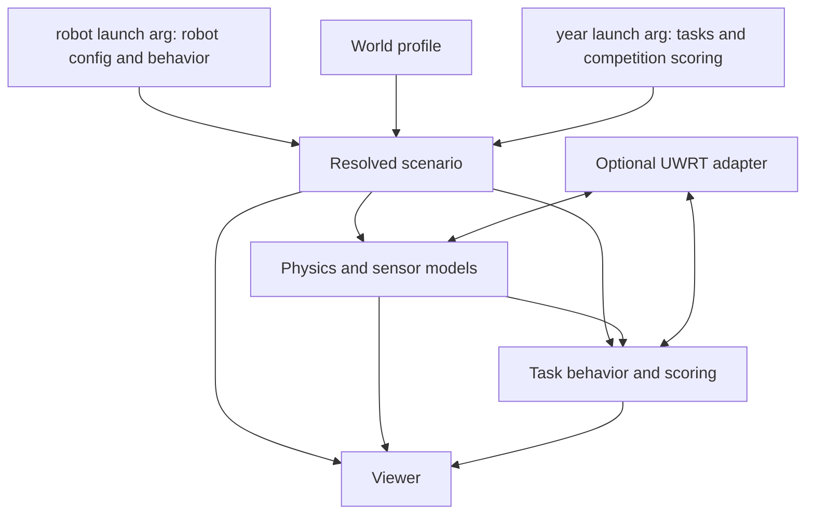

# Robot and task independence

Status: proposed plan only. The architecture below has not been implemented.

## Goal and scope

Run a different underwater robot in a different course without modifying the
physics integrator, renderer, or ROS launch internals. Adding equipment or a
task with new behavior may require a small, explicit extension; changing robot
dimensions, sensor names, course layout, or scoring values should require data.

Configuration is the first choice. Robot-specific behavior lives beside that
robot's configuration; task and competition behavior lives in a pack organized
by year. The current selections are Talos and RoboSub 2026. A future robot can
have different mechanisms, and a future year can have different tasks and
scoring, independently of one another.

Assume ROS 2 and underwater rigid-body simulation remain the target. Keep the
current Fossen plant, OpenGL viewer, and Talos integration. General-purpose land
robot simulation, a new physics engine, and simultaneous multi-robot simulation
are outside the first migration. Separate robot model identity from instance
name/namespace internally so future multi-robot work is possible. For today's
launch flow, the existing `robot:=` argument from `riptide_bringup` selects the
robot profile and supplies the default namespace. No second robot selector is
required.

Success means a second robot with a different thruster count and camera layout
can run a new task, and an empty course can run without any task equipment or
scoring dependencies. Existing Talos behavior must remain covered throughout.

## Where the coupling is today

| Area | Current coupling | Extraction target |
| --- | --- | --- |
| Dynamics | `MarineDynamics` and `ThrusterDynamics` already contain reusable numerical models. `robot_class.cpp` mixes model loading, ROS, and sensor mounting; it also names `ffc` and `talos/base_inertia`. | Keep the models; move vehicle configuration and frame conventions into a robot profile and adapter. |
| Sensors and commands | The viewer constructs `ffc`/`dfc` cameras. The plant assumes particular sensor streams and publishes two four-thruster telemetry blocks. | Lists of sensor/device instances; optional UWRT message and topic adapters. |
| Equipment | `talos_tasks.yaml` mixes launcher/claw geometry and payload properties with target geometry and scoring. `payload_mounts.hpp` requires exactly two torpedo slots. | Equipment definitions belong to the robot; target geometry and rules belong to the task. |
| World | Pool dimensions/floor are embedded in `physics_simulator.cpp`, `renderer.cpp`, and `claw_world.py`. Course poses come from robot-specific mapping YAML; visuals come from RViz marker configuration. | One world description consumed by all physics and rendering components. |
| Tasks | `task_simulator.py` resolves named bins and a torpedo target even before selecting optional tasks. `TaskContacts` knows jaws and props. | Optional task instances composed from reusable geometry/contact and equipment capabilities. |
| Rules and UI | `run_score.py` implements RoboSub 2026 rules. `main.cpp` contains role choices, fixed task navigation, and a named scorecard. | A RoboSub 2026 task pack that supplies rules and UI metadata. |
| Launch and assets | Launches reach into `riptide_hardware2`, descriptions, meshes, RViz, and mapping packages, and default to `talos_tasks.yaml`. | Explicit profile/asset resolution plus an optional Talos bringup adapter. |

## Proposed configuration boundaries

Four small, versioned descriptions compose a run:

1. **Robot profile:** model identity, visual/collision assets, CAD/base/COM
   transforms, mass and hydrodynamics, thruster instances, sensors, and equipment.
   Camera names, calibrations, mounting frames, rates, and noise models are data.
   Equipment specifies launcher slots, payload types, gripper joints, or magnets.
   Empty sensor/equipment lists are valid. Existing URDF and vehicle YAML should
   be referenced or imported, not maintained as competing robot descriptions.
2. **World profile:** water surface, density/current, bounds/floor, lighting,
   static objects, asset transforms, collision materials, and named frames.
   Environment properties have one source rather than copies in each robot and
   contact solver. Support a simple pool first; arbitrary terrain can follow.
3. **Year pack:** task types and instances, task-owned assets, interactions,
   competition rules, scoring tables, UI metadata, and required capabilities.
   The initial pack is `tasks/2026`. Each year owns its scoring behavior and
   parameters, including bonuses, sequencing, penalties, run options, and
   eligibility rules. Keep robot names out of these definitions. Reuse common
   task mechanisms across years where useful, while retaining each year's rules.
4. **Scenario:** selects the world, enabled tasks from the selected year, bindings,
   initial poses, seed, physics/sensor rates, enabled adapters, and run defaults.
   Each instance has a stable ID. Multiple copies of one task type are valid.
   The scenario uses the robot selected by `robot:=`; it cannot silently replace
   that robot or change the selected competition year.

For example, a target task binds to a named target entity and a compatible
launcher capability; it does not assume a frame called `torpedo`, a Talos mesh,
or two launch tubes. A gate task binds to geometry and reports a passage event;
the competition rules decide how much that passage is worth.

## Selection, folders, and configuration policy

Keep the current bringup interface. Proposed usage after implementation:

```bash
# robot:= already exists; year:= and scenario:= are proposed additions.
ros2 launch riptide_bringup2 simulation.launch.py robot:=talos year:=2026
ros2 launch riptide_bringup2 simulation.launch.py robot:=another_robot year:=2027
```

`riptide_bringup` forwards these selections through the full simulator launch.
Resolve them once and pass the same resolved configuration to physics, tasks,
and the viewer. Default `year` to `2026` during migration so existing commands
keep working. Changing `robot` never implicitly changes the year, and changing
`year` never selects another robot. Fail clearly for unknown robot/year names.

Proposed logical layout within the existing `c_simulator` package:

```text
robots/
  talos/
    robot.yaml                 # References existing vehicle description + sim config
    config/                    # Hydrodynamics, sensors, mechanisms, adapter bindings
    behavior/                  # Optional Talos-specific mechanism/adapter code
    assets/                    # Robot-owned simulation assets, or external references
tasks/
  2026/
    competition.yaml           # Pack manifest, task definitions, behavior registrations
    config/                    # Task geometry, interaction settings, scoring tables
    behavior/                  # Task logic and competition-specific scoring logic
    scenarios/                 # Course layouts, enabled tasks, run defaults
    assets/                    # Course/target assets, or external references
  2027/                        # Added when that year's tasks/rules are known
worlds/                        # Pool/environment descriptions reusable across years
behaviors/                     # Shared mechanism, interaction, and scoring primitives
```

These are installable package resources and modules, not assumptions about a
source-tree layout. Both simulator packages consume the selected manifests;
the viewer does not maintain its own copy of robot or year definitions. Install
Python behaviors as importable modules. Register any C++ behavior needed for
physics-step contacts through a narrow compiled interface; adding such a
behavior requires building its extension, without editing core dispatch logic.

Use configuration for masses, geometry, frames, sensor lists, actuator counts,
joint limits, command bindings, rates, timeouts, thresholds, point values, bonus
amounts, task order constraints supported by existing rules, and UI labels/defaults.
Prefer composing an existing mechanism or rule type with new configuration.
Use code for a new mechanism's state transitions or physical behavior, a new
interaction detector, or a scoring condition that existing rule types cannot
express. Reference registered behavior types explicitly in each manifest.

For example, launcher count and seating offsets belong in robot configuration.
A new loading mechanism's sequencing can live under `robots/<robot>/behavior`.
Target-hit detection and scoring for that competition belong under
`tasks/<year>/behavior`, with hole dimensions and point awards in the year's
configuration. Neither side selects behavior with `if robot == ...` or
`if year == ...` branches in the core.

Robot mechanisms expose capabilities such as launching a payload, gripping,
or presenting a magnetic field, with stable instance IDs and command/state
contracts. Tasks bind to those capabilities and world entities through config.
Use robot-local aliases or adapter bindings when mechanisms expose different
native commands. Reject ambiguous bindings; do not infer a mechanism from a
robot name. An enabled task missing required capabilities fails validation;
practice scenarios can explicitly disable that task. Changing mechanism
implementations should not require a copy of the year's task/scoring pack.

Resolve settings in this order: shared defaults, selected robot/year/world
configuration within their owned fields, scenario overrides in supported
fields, then explicit launch overrides. Robot physical settings belong to the
robot profile; competition rule settings belong to the year pack. Scenarios
configure composition and practice variations, not arbitrary cross-profile
overrides. Record any scoring overrides with the run result. Runtime UI edits
remain session-local unless the user explicitly saves configuration.

Resolve the scenario into an immutable, validated run description before nodes
start. Define units, coordinate conventions, asset paths, schema versions, and
override precedence. Record the resolved configuration and seed with results.
Resolve assets relative to their profile or through package URIs, without
assuming the workspace contains `src/riptide_simulator` at runtime.



## Runtime boundaries

- **Physics and time:** one simulation clock; one authoritative owner per body.
  The plant owns AUV integration and vehicle contact response. Preserve local
  collision resolution inside the physics step. Dynamic-prop solvers retain
  explicit ownership of their bodies. Define step IDs, command application,
  contact exchange, pause, teleport, and reset semantics across these components
  before allowing arbitrary task extensions. Avoid two solvers independently
  integrating the same body or applying the same contact response twice.
- **World and geometry:** all consumers read the same entity definitions and
  frame graph. Visual meshes and collision proxies can differ deliberately, but
  share poses and physical dimensions. Move gate/crate/octagon construction and
  target-specific render features out of the engine into task-owned descriptors.
  Existing mapping/RViz configuration can be imported into the initial world
  profile and exported for the UWRT stack; it stops being a runtime prerequisite
  for standalone simulation.
- **Tasks and scoring:** start with an explicit registry of Python task modules,
  following the current implementation language. Give modules a narrow lifecycle:
  configure, reset, consume timestamped state/events, advance, and report state,
  events, score rows, and available controls. Reusable mechanisms handle payload
  flight, grasp/contact, proximity, and region crossings. Load robot-specific
  mechanisms from the selected robot's manifest and task/scoring modules from
  the selected year's manifest. Competition rules consume the observations,
  use configurable awards/tolerances, and report score rows and eligibility.
  General run timing, event transport, and reset infrastructure remain shared;
  year-specific roles, bonuses, and scoring conditions remain in the year pack.
  Avoid a general rules language in the first pass; use a small set of common
  rule types plus code extensions when a year's rules need new behavior.
- **Interfaces:** use versioned, typed state/command/event contracts with entity
  IDs and simulation timestamps. ROS adapters translate those contracts to
  current UWRT actuator, kill, telemetry, navigation, and perception conventions.
  Preserve existing Talos topics through its adapter. Sensor optical frames and
  truth-versus-estimated pose remain distinct and explicitly configured.
- **Viewer:** discover cameras, devices, task entities, focus targets, score rows,
  and run options from the resolved scenario and task metadata. Common controls
  cover booleans, choices, numbers, and actions. Heading/role coin flips become
  defaults supplied by the 2026 pack. Scorecard titles, role choices, point
  categories, and task controls also come from the selected year's metadata.
  The viewer observes state and requests
  actions; it does not own scoring or physical truth.

## Migration sequence and acceptance gates

### 1. Capture Talos as the reference scenario

Inventory the remaining robot/task literals and define the four schemas and
their ownership. Establish `robots/talos` and `tasks/2026`; add the shared
loader/validator and forward the existing `robot:=` argument plus the new
`year:=2026` default through bringup. Resolve the existing inputs without
changing runtime behavior. Validate missing assets,
unknown frames, frame cycles, duplicate IDs, invalid physical values, and
incompatible equipment bindings with useful file/field errors.

**Gate:** `robot:=talos` keeps working and resolves the same robot/year in every
node. The preset reproduces today's dimensions, poses, calibration, hydrodynamics,
scoring settings, and launch arguments. Existing tests still pass. Unknown
selections fail before partial simulator startup.

### 2. Make the robot independent of its ROS stack

Separate model identity from namespace. Load arbitrary thruster/sensor/device
lists and explicit collision assets. Remove fixed camera names, two-slot payload
assumptions, eight-thruster telemetry assumptions, and mandatory missing sensors.
Put UWRT-specific messages, hardware configuration translation, and navigation
startup into its adapter. Put Talos-specific mechanism behavior under its robot
folder, configured through its manifest. Keep the current launch entry point;
`robot:=<name>` selects each robot's config and registered behavior.

**Gate:** a minimal second robot with four thrusters, one differently named camera,
and no payloads runs with generic commands and sensor outputs. Also exercise zero
cameras and a custom namespace. A second mechanism with different command/state
behavior can be added in that robot's folder and selected by configuration.
This must not require changing engine code or installing the Talos
navigation/controller stack.

### 3. Make the world authoritative

Move pool dimensions, floor/water levels, course frames, assets, and static
collision geometry into the world profile. Feed the plant, viewer, and prop
solver the same resolved geometry. Provide a neutral empty-pool scenario. Remove
the requirement for robot-namespaced mapping data and RViz marker configuration.

**Gate:** change pool dimensions and depth once; verify camera depth, AUV contacts,
and prop contacts agree. The empty world loads with no gate, bins, table, octagon,
or scoring module. A staged install works without a source checkout.

### 4. Extract equipment, tasks, and the RoboSub rules

Split the current task configuration into robot equipment and task instances.
Extract the existing flight/contact/proximity mechanisms, then register the
current course behavior and `RunScore`/`CourseJudge` under `tasks/2026`.
Move point values, thresholds, role options, and supported rule settings into
that year's configuration, with year-specific logic in its behavior folder.
Specify timestamped events and reset ordering; preserve Talos's current contact
behavior while separating its code. Generalize viewer entity updates and score
controls alongside this extraction so renderer task assumptions do not remain.

**Gate:** existing Talos task/scoring/contact regressions pass. Disabled tasks
resolve no task-specific frames, create no bodies, and register no controls.
Multiple instances of one task work. Restart/reset does not retain stale events,
attachments, scores, or actuator state. Adjust a point value in 2026 configuration
and verify both calculated score and UI output reflect it without code changes.

### 5. Prove reuse with a different task

Add a small new task, such as a configurable sequence of observation regions,
through only a separate year-pack fixture, configuration, behavior module, and
assets. Give that fixture different scoring rules and UI metadata without
assuming future official rules. Run it with both robot profiles, including a
robot with a different mechanism implementation. Document how to add a robot,
mechanism, world, task, and competition year, including which changes require a
behavior extension rather than configuration.

**Gate:** robot × scenario coverage includes Talos/RoboSub, second robot/empty
pool, and both robots/new year/task/scoring. Verify that changing `robot:=`
preserves the selected rules, changing `year:=` preserves the robot, and 2026
results stay unchanged after adding the new pack. Exercise simulation-time pause/reset, seeded
replay within numerical tolerances, missing-capability errors, headless runs,
and camera/TF geometry. Confirm performance remains acceptable against today's
baseline before calling the migration complete.

## Decisions and sequencing

Start with config selection through `robot:=`/`year:=` and the second robot,
keeping package/executable
names stable. Package renaming and a broad repository split add migration cost
without proving reuse; consider them after the second scenario works. Logical
boundaries above can initially live in the existing two packages. Optional UWRT
adapters must eventually have separate dependency boundaries so standalone users
do not inherit the complete robot stack.

The main risks are frame-origin mistakes, visual/collision geometry divergence,
and changed timing between the plant and prop/task solvers. Preserve the existing
geometry and ROS smoke tests, and migrate one boundary at a time. Configuration
flexibility does not make hydrodynamic priors accurate for a new hull; each robot
profile still needs its own documented parameters and validation.

First implementation milestone: select Talos or a small second robot using the
existing `robot:=` argument, load its config and optional robot-local behavior,
and run in an empty configurable pool with no task dependencies. Next extract
the 2026 task/scoring pack and demonstrate a separate year pack with both robots.
